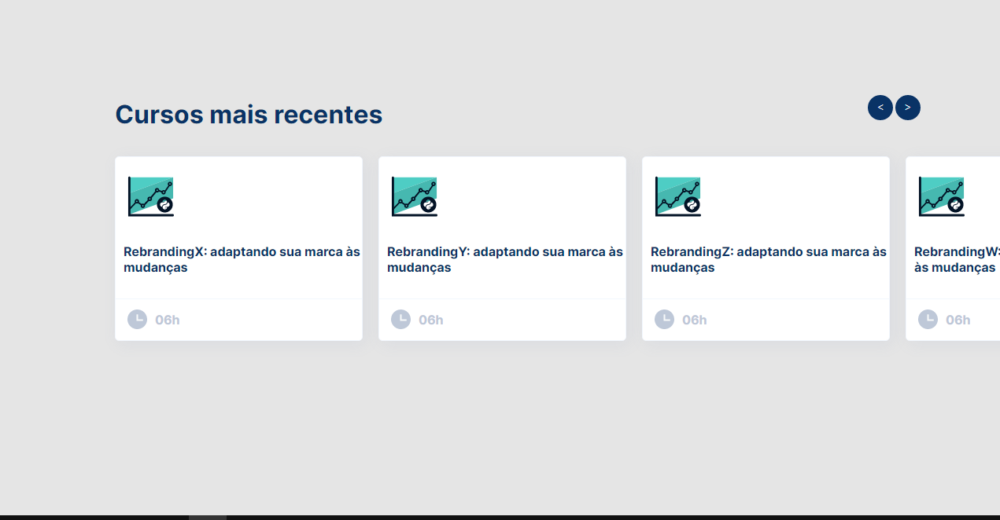

# Alura - Desafio

Desafio proposto como teste técnico para a vaga de FrontEnd Iniciante na Alura.

O desafio era criar um carrossel usando apenas HTML, CSS e JavaScript puro e seguindo o protótipo enviado

[Protótipo](https://www.figma.com/file/ulBnqmFORk0Z4ORkhnl7IV/%5BTESTE%5D-Listagem-Cursos?node-id=1%3A2)

## How-to-access

O live-code pode ser acessado em:
[Desafio Alura](https://alura-desafio.vercel.app/)

## Stack utilizada

HTML, CSS e JavaScript puro

## Realizado por

Claudia Maia Gripp

## Suporte

Para suporte, abrir uma issue.
